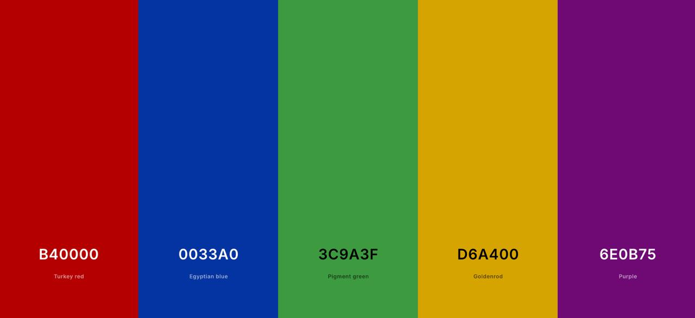

# Introduction

Through this file, we will reveal the number and nature of the partnerships between heroes, villains, and neutral characters across the Marvel Universe. While doing so, we will try to answer a number of questions that were raised as part of the first homework assignment for the Social Network Analysis. 

## Libraries

```{r message=FALSE}

library(igraph)
library(stringr)
library(dplyr)
library(ggraph) # ultimately, might not use it. check at the end
library(tidygraph) # ultimately, might not use it. check at the end
library(ggrepel)
library(extrafont)
library(tibble)
library(fmsb)
library(GGally)
```

# Questions

## Choose a network dataset

Marvel character partnerships, 2018. The dataset can be accessed through this [link](https://networks.skewed.de/net/marvel_partnerships)

## Indicate the number of nodes should be larger than 300 but smaller than 10000.

The number of nodes is 350.

```{r}

load("marvel_network.rda")

# for the number of nodes
num_nodes <- vcount(marvel_network)

cat("Number of nodes:", num_nodes)

```

## Import that data and create a graph using R.

Reading the data

```{r}

marvel_nodes <- read.csv("data/nodes.csv", stringsAsFactors = FALSE, quote = "\"", fill = TRUE)

marvel_links <- read.csv("data/edges.csv", stringsAsFactors = FALSE)

```

### Data description

Initially, we have two datasets separately for nodes and links. Later on, they will be merged.

1. The dataset for the nodes includes the following variables:

**id:** The index number of the character in the network.

**character_name:** The name of the character, which could be a hero, villain, or neutral character.

**group:** Indicates the category of the character (e.g., hero, villain, or neutral).

**size:** Represents the number of partnerships the character has within the network.

**x:** The X-coordinate that positions the character in the network layout.

**y:** The Y-coordinate that positions the character in the network layout.


2. The dataset for the links, on the other hand, incorporates the following variables:

**source:** This column represents the starting character in a partnership (the character initiating or belonging to the partnership).

**target:** This column indicates the partner in the relationship with the source character.


### Data cleaning

Let's read both datasets, treating text as characters (not factors), and ensuring quotes and missing data are handled properly.


```{r}
# to get proper x and y coordinates

marvel_nodes$pos_x <- as.numeric(str_extract(marvel_nodes$X_pos, "-?\\d+\\.\\d+"))
marvel_nodes$pos_y <- as.numeric(str_extract_all(marvel_nodes$X_pos, "-?\\d+\\.\\d+") %>% sapply(`[`, 2))

# we don't need the X_pos anymore
marvel_nodes$X_pos <- NULL

```

### Renaming columns

To improve readability, we will rename certain columns in both datasets. After that, we will remove any alternative names or descriptions that appear in parentheses following a character’s name.

```{r}

marvel_nodes <- marvel_nodes |> 
  rename(id = X..index,
         character_name = id,
         x = pos_x,
         y = pos_y) |> 
  mutate(id = id + 1) # for best indexing practice

marvel_links <- marvel_links |> 
  rename(source = X..source,
         target = target)

marvel_links <- marvel_links |> 
  mutate(source = source + 1,
         target = target + 1)

# let's get rid of anything that is in parentheses in the character_name columns
marvel_nodes$character_name <- gsub(" \\(.*?\\)", "", marvel_nodes$character_name)
```

### Plot

Plotting the network, without distinguishing between heroes, villains, and neutral characters.

```{r}
marvel_network <- graph_from_data_frame(d = marvel_links, vertices = marvel_nodes, directed = FALSE)

etiqueta <- ifelse(degree(marvel_network) > 5, V(marvel_network)$character_name, "")

# Plot the network
plot(marvel_network,
     vertex.size = degree(marvel_network),  # Node size by degree
     edge.width = 1,  # No edge value attribute, set to constant
     vertex.color = "lightblue",  # No colour attribute, use a constant color
     vertex.label = etiqueta,
     vertex.label.family = "Marvel",  # Use your font
     vertex.label.dist = 1,
     vertex.label.cex = 1.0)

save(marvel_network, file = "marvel_network.rda")
```

Let's work on a cleaner plot, ideally we wanted to plot it with those characters that has the biggest sizes (number of partnerships) only, but we were not able to position the node labels clearly.

For the font of use:

```{r message=FALSE, warning=FALSE}

font_import(pattern = "Marvel") 
loadfonts() 

# setting font globally
par(family = "Marvel")

```

For the colours, we created a unique palette using the colours for the main Marvel superheroes:



1. Iron Man Red – #B40000

2. Captain America Blue – #0033A0

3. Hulk Green – #3C9A3F

4. Thor Gold – #D6A400

5. Loki Purple – #6E0B75


```{r message=FALSE, warning=FALSE}

# defining a color for each group - heroes '0', villains '1', and neither '2'

group_colors <- c("0" = "#B40000", "1" = "#0033A0", "2" = "#3C9A3F")

```

```{r warning=FALSE}
V(marvel_network)$group <- marvel_nodes$group

plot(marvel_network, 
     vertex.label = NA,                      
     vertex.size = 5,                        # node size
     edge.color = "gray15",                  # link line color
     vertex.color = group_colors[as.character(V(marvel_network)$group)],  # colors by group
     layout = cbind(V(marvel_network)$x, V(marvel_network)$y))  # for the coordinates

title("Marvel Partnerships Network", cex.main = 1.2)

# for the legend
legend("topleft", 
       legend = c("Heroes (0)", "Villains (1)", "Neither (2)"), 
       col = c("#B40000", "#0033A0", "#3C9A3F"), 
       pch = 16,  
       bty = "y")
```


Let's see the characters that are represented by bigger nodes, in other words, the ones with most partnerships.

```{r}
# plot with labels for the biggest nodes

# the degree of each node
degrees <- degree(marvel_network)

# determining a threshold for "biggest" nodes
threshold <- quantile(degrees, 0.98)

# identifying nodes with degree above our threshold
big_nodes <- V(marvel_network)[degrees > threshold]$character_name

# plotting the network with labels for the biggest nodes
plot(marvel_network,
     vertex.label = ifelse(degrees > threshold, V(marvel_network)$character_name, NA),
     vertex.size = degrees / max(degrees) * 10,  
     edge.color = "gray15",
     vertex.color = group_colors[as.character(V(marvel_network)$group)],
     layout = cbind(V(marvel_network)$x, V(marvel_network)$y),
     vertex.label.family = "Marvel",
     vertex.label.cez = 0.5,
     vertex.label.color = "black") 

par(family = "Marvel")
title("Marvel Partnerships Network", cex.main = 1.2)

# Add legend
legend("topleft",
       legend = c("Heroes (0)", "Villains (1)", "Neither (2)"),
       col = c("#B40000", "#0033A0", "#3C9A3F"),
       pch = 16,
       bty = "y",
       cex = 0.8,  
       text.font = 2) 
```

## What is the number of nodes and links? 

The number of nodes for the Marvel network is 350, meaning that the network consists of 350 different Marvel characters (Heroes, Villains, and Neither).

The number of links (the number of partnerships amongst all characters) is 346.
This means that there are 346 different partnerships formed by the characters.

```{r}
# extracting number of nodes (characters) and links (partnerships)

num_nodes <- vcount(marvel_network)
num_links <- ecount(marvel_network)

# results
cat("Marvel Network Nodes:", num_nodes, "\nMarvel Network Links:", num_links, "\n")

# a simple plot

bp_nodes_links <- barplot(c(num_nodes, num_links), 
              names.arg = c("Nodes", "Links"), 
              main = "Marvel Network Size", 
              col = c("#D6A400", "#6E0B75"),  
              ylim = c(0, max(num_nodes, num_links) * 1.3))  
text(bp_nodes_links, c(num_nodes, num_links) / 2,  
     labels = c(num_nodes, num_links), col = "white", cex = 1.2)
```

## What is the average degree in the network? And the standard deviation of the degree? 

We start with calculating the number of connections (links) for each node in the network.
The degree function helps us count the number of incoming and outgoing links.
This choice is due to the fact that the network is not a directed one (which means that connections go both ways, aka it takes two to tango).

Results show us that, on average, each Marvel character has about 2 (1.977143) partnerships.

As for the standard deviation, the number of partnerships per character typically differs from the average by 1.5 (1.54012).
This implies that some characters have more or fewer partnerships by 1.5, which tells us that the number does not vary wildly.

```{r}

# calculating degrees, average links and standard deviations

degrees <- degree(marvel_network, mode = "all")
avg_degree <- mean(degrees)
std_dev_degree <- sd(degrees)

# results
cat("Average degree:", avg_degree, "\nStandard deviation:", std_dev_degree, "\n")

```

## Plot the degree distribution in linear-linear scale and in log-log-scale. Does it have a typical connectivity? What is the degree of the most connected node?

Linear-linear scale shows how many nodes have each degree on regular scales.
There is a sharp peak around the lower numbers of partnerships (1,2,3, and 4) with a long tail all the way towards 12, showing us the maximum number of partnerships possessed by a single character.
The right-skewed distribution implies an uneven distributiın of partnerships.
An interesting finding from this plot is that the number of characters with 4 partnerships is greater than that of characters with 3 partnerships.

The log-log plot of the degree distribution shows a scattered pattern, rather than a straight line, indicating that the network does not follow a power-law distribution typical of scale-free networks.
Instead, the degrees (1 to 12) suggest a more random or even connectivity pattern among the characters.
This also means that there are no dominant hubs.

```{r}
# we previously calculated the degrees for all nodes:

# print(degrees)

# distribution of partnership numbers (linear-linear)

degrees <- degree(marvel_network, mode = "all")
hist(degrees, main = "Degree Distribution", xlab = "Number of Partnerships", col = "#B40000")

# log-log

plot(table(degrees), log = "xy", main = "Degree Distribution (Log-Log)", xlab = "Degree", ylab = "Frequency", pch = 16, col = "#0033A0")

max_degree <- max(degrees)

```


## What is the clustering coefficient (transitivity) in the network?

Transitivity measures how often nodes’ neighbors are also connected.
The transitivity value of 0.2194149 indicates that the network is more spread out than being tightly knit.

```{r}

clustering_coeff <- transitivity(marvel_network, type = "global")

#results
cat("Clustering coefficient:", clustering_coeff, "\n")

```

## What is the assortativity (degree) in the network?

Assortativity measures if nodes with similar degrees connect (positive value) or if high-degree nodes connect to low-degree ones (negative value).

As explained earlier, we use 'directed = FALSE' because our network is bidirectional, meaning that a link (partnership) requires two parties.

The result (assortativity degree of -0.011047) shows that in the Marvel network, characters with high numbers of partnerships slightly tend to connect with those with fewer partnerships, but the effect is very weak (because it is very close to 0), almost random.

```{r}

assortativity_degree <- assortativity_degree(marvel_network, directed = FALSE)

# result  
cat("Assortativity (degree):", assortativity_degree, "\n")

```

Visually:


!!!!!!!! I changed Au's plot here because something was causing a fatal error in my computer. We can try to work with the previous plot because it was prettier. 

```{r}
V(marvel_network)$degree <- degree(marvel_network, mode = "all")

# Plot with igraph using a different layout
plot(marvel_network, 
     layout = layout_with_kk(marvel_network),  # kamada-kawaii layout
     vertex.size = V(marvel_network)$degree / 2,
     vertex.color = colorRampPalette(c("#0033A0", "#B40000"))(max(V(marvel_network)$degree) + 1)[V(marvel_network)$degree + 1],
     vertex.label = NA,
     edge.alpha = 0.5,
     main = "Assortativity Visualization")
```

## Using the Louvain method, does the network have a community structure?

Initially we wanted to check if there's a community structure with and without edge weights. However, our network is not one that shows the strength or times of occurrence of edges, rather, it only shows the number of partnerships that existed at some point. That is why we decided to assess the community structure with 'weights = NULL'.

So, yes, the network exhibits a clear community structure, as shown in the plot where nodes are grouped into distinct clusters with distinct colors and labeled IDs, indicating that characters form close groups with more internal connections than external ones, a hallmark of community structure. 


```{r}
set.seed(616)
comm_without_weights <- cluster_louvain(marvel_network,weights=NULL)

sizes(comm_without_weights)
```

Plotting the community structure

```{r}

plot(comm_without_weights, marvel_network)
```

Let's check the community structure with weights just in case. Results are pretty much the same. Does this most probably imply that the network does not suit for a weighted assessment of community structure?

```{r}
comm_with_weights <- cluster_louvain(marvel_network,weights = E(marvel_network)$size)
sizes(comm_with_weights)

# plotting

plot(comm_with_weights, marvel_network)
```

-----------


## If so, what is its modularity?

The modularity score of 0.9116242 indicates a very strong community structure in the Marvel network, as values close to 1 suggest that the Louvain method found highly distinct groups where characters are much more connected within their communities than expected in a random network. 

This aligns with the visual clustering in our plot, confirming that the network has well-defined, meaningful communities.


```{r}
set.seed(616)
modularity(comm_without_weights)

```

Below plot visualizes the network with communities from comm_without_weights, using the Kamada-Kawai layout ll, coloring nodes by community, and omitting vertex labels for clarity.

The Kamada-Kawai layout tries to put characters closer if they’re partners and further apart if they’re not, making the plot and structure easier to understand.


```{r}

ll <- layout.kamada.kawai(marvel_network)
plot(comm_without_weights,marvel_network,layout=ll,vertex.label="")

```


## Test that the clustering coefficient in the network cannot be statistically explained by a configuration model in which the nodes have the same degree distribution as the original.

After generating a degree-preserving rewired version of the Marvel network across 100 random times, we find that the clustering coefficient drops from 0.219 (the original Marvel network clustering coefficient) to 0.006382979 (the mean of the simulated clusterings). The p-value of 0 feels fishy in the beginning, however, it only indicates that none of the simulations were as high as or higher than the original one.

This significant decrease suggests that the clustering structure observed in the real network is not explained by the degree distribution alone. Instead, it reflects meaningful group structures, such as narrative teams or recurring character associations in the Marvel universe.

The original Marvel network has much higher clustering than its degree-preserving random counterpart: characters that are connected to the same person tend to be connected to each other — suggesting intentional grouping or narrative structure (such as teams like Avengers or X-Men).

In the rewired version, where the number of connections for each character is preserved but partners are randomized, that natural tendency disappears.

```{r}
set.seed(616)

sim_clustering <- replicate(100, {
  g_rewired <- rewire(marvel_network, with = keeping_degseq(niter = ecount(marvel_network) * 10))
  transitivity(g_rewired, type = "global")
})

observed_clustering <- transitivity(marvel_network, type = "global")

# computing p-value, meaning the proportion of simulated clustering ≥ observed)
p_val <- mean(sim_clustering >= observed_clustering)

cat("Observed clustering:", observed_clustering, "\n")
cat("Mean simulated clustering:", mean(sim_clustering), "\n")
cat("p-value:", p_val, "\n")
```

### Comparing the two networks

```{r}

data <- data.frame(
  Network = c("Original", "Simulated Mean"),
  Clustering = c(observed_clustering, mean(sim_clustering))
)

ggplot(data, aes(x = Network, y = Clustering, fill = Network)) +
  geom_col(width = 0.5) +
  geom_text(aes(label = round(Clustering, 3)), vjust = -0.5) +
  scale_fill_manual(values = c("Original" = "#3C9A3F", "Simulated Mean" = "#D6A400")) +
  labs(title = "Clustering Coefficient: Observed vs. Simulated",
       y = "Clustering Coefficient") +
  theme_minimal()
```

## Visualize the neighborhood of the node with the largest centrality (closeness).

igraph package has several ways to calculate centrality of nodes and edges. Let's try them and see how the results differ.

### PageRank: calculates Google’s PageRank for vertices

Below chunk calculates the PageRank scores for nodes in marvel_network, which measures node importance based on connections — nodes with more links from other important nodes get higher scores. 

The results show Spider-Man, Captain America, Red Skull, Selene, Unicorn, and Grim Reaper as the top 6, indicating they are the most influential characters in the network, likely due to their connections to other highly connected characters, such as Spider-Man and Captain America linking to many key Avengers or Red Skull to major villains.


```{r}

# pageRank centrality computation
page_rank_marvel <- page_rank(marvel_network)

# top characters

top_pr <- page_rank_marvel$vector %>% sort(decreasing = TRUE) %>% head()
data.frame(
  character_name = V(marvel_network)$character_name[as.numeric(names(top_pr))],
  page_rank = top_pr
)
```


### Closeness: distance (steps) to any other vertex

Closeness calculates the closeness centrality for each node in the network, measuring how close a node is to all others. Higher values mean closer, fewer steps to reach others. 

The results, with closeness of 1 for Silver Sable, U.S. Agent, Hercules, Sabretooth, Mojo, and Trevor Fitzroy, indicate these characters have the highest closeness, meaning they are in small, isolated components, where they are directly connected to all others in their component, inflating their scores. We consider that these characters have perfect centrality scores because the closeness method assesses their local communities, rather than the network as a whole. 


```{r}
# closeness  computation
closeness_marvel <- closeness(marvel_network)

# to get the top characters

top_closeness <- 1/closeness_marvel %>% sort(decreasing = TRUE) %>% head()
data.frame(
  character_name = V(marvel_network)$character_name[as.numeric(names(top_closeness))],
  inverse_closeness = top_closeness
)

```


Betweenness method looks into the number of shortest paths going through an edge.

The results show Venom, Doctor Doom, Spider-Man, Puppet Master, Krang, and Attuma as the top six characters, meaning they are key bridges in the network, frequently connecting other characters.

```{r}

# betweenness centrality computation
betweenness_marvel <- betweenness(marvel_network)

# top characters
top_betweenness <- betweenness_marvel %>% sort(decreasing = TRUE) %>% head()
data.frame(
  character_name = V(marvel_network)$character_name[as.numeric(names(top_betweenness))],
  betweenness = top_betweenness
)
```


#### Calculate the centrality of the characters in the Marvel network using the page rank, closeness, betweenness.

Page Rank: Spider-Man, Captain America, Red Skull, Selene, Unicorn, Grim Reaper

Closeness: Silver Sable, U.S. Agent, Hercules, Sabretooth, Mojo, Trevor Fitzroy (Likely to be incorrect, because they have closeness scores of 1, which is a perfect score)

Betweenness: Venom - Doctor Doom - Spider-Man - Puppet Master - Krang - Attuma

```{r}
# Calculate centrality measures
cent_betw <- betweenness(marvel_network, weights = E(marvel_network)$size)
cent_page <- page_rank(marvel_network, weights = E(marvel_network)$size)$vector
cent_close <- closeness(marvel_network)

# Create a data frame with all measures
centrality_df <- data.frame(
  character_name = V(marvel_network)$character_name,
  betweenness = cent_betw,
  page_rank = cent_page,
  closeness = cent_close
)


# top 6 by PageRank
top_pagerank <- centrality_df[order(-centrality_df$page_rank), ][1:6, c("character_name", "page_rank")]
print("Top 6 by PageRank:")
print(top_pagerank)

# top 6 by closeness
top_closeness <- centrality_df[order(-centrality_df$closeness), ][1:6, c("character_name", "closeness")]
print("Top 6 by Closeness:")
print(top_closeness)

# top 6 by betweenness
top_betweenness <- centrality_df[order(-centrality_df$betweenness), ][1:6, c("character_name", "betweenness")]
print("Top 6 by Betweenness:")
print(top_betweenness)

```

#### Harmonic Centrality

As suggested, we decided to calculate the harmonic centrality for our network. We did so using the harmonic_centrality function from the igraph package. Harmonic centrality is a measure that gives higher scores to nodes that are closer to other nodes in the network. It is particularly useful in networks where shortest path calculations are important.

The code identifies and prints the top 6 characters by harmonic centrality.

```{r}
# Calculate harmonic centrality
cent_harmonic <- harmonic_centrality(marvel_network)

# Update the centrality data frame with harmonic centrality
centrality_df$harmonic_centrality <- cent_harmonic

# Display the top 6 characters by harmonic centrality
top_harmonic <- centrality_df[order(-centrality_df$harmonic_centrality), ][1:6, c("character_name", "harmonic_centrality")]
print("Top 6 by Harmonic Centrality:")
print(top_harmonic)


```

We can use a scatter plot or a bar plot to visualize the harmonic centrality of nodes. 
We used a scatter plot with ggplot2 to compare harmonic centrality with other centrality measures.

This plot compares harmonic centrality with closeness centrality, with nodes colored by their PageRank. This allows us to see how these centrality measures relate to each other.
Nodes with high harmonic centrality and closeness centrality are likely important connectors in the network.

```{r}
# Load necessary libraries
library(ggplot2)

# Scatter plot to visualize harmonic centrality vs. other centrality measures
ggplot(centrality_df, aes(x = harmonic_centrality, y = closeness, color = page_rank)) +
  geom_point(alpha = 0.6, size = 3) +
  labs(title = "Harmonic Centrality vs. Closeness Centrality",
       x = "Harmonic Centrality",
       y = "Closeness Centrality",
       color = "PageRank") +
  theme_minimal() +
  theme(plot.title = element_text(family = "Marvel", size = 16))

```

Alternatively, we can visualize the top nodes by harmonic centrality through a bar plot.
This plot shows the top 10 characters by harmonic centrality, allowing us to easily identify the most central nodes.

```{r}
# Bar plot to visualize top nodes by harmonic centrality
top_harmonic_plot <- centrality_df[order(-centrality_df$harmonic_centrality), ][1:10, ]

ggplot(top_harmonic_plot, aes(x = reorder(character_name, harmonic_centrality), y = harmonic_centrality)) +
  geom_bar(stat = "identity", fill = "#B40000") +
  coord_flip() +
  labs(title = "Top 10 Characters by Harmonic Centrality",
       x = "Character Name",
       y = "Harmonic Centrality") +
  theme_minimal() +
  theme(plot.title = element_text(family = "Marvel", size = 16))

```

### The neighbourhood of the most central node - VENOM

According to our harmonic centrality measure, Venom is the most central character in the entire Marvel network. Indeed, if we zoom in even on his 1-step neighbourhood, we see that he formed partnerships with heroes (Spider-Man), villains (Red Skull, Doctor Doom, Carnage), and neutral characters (Magneto, Eddie Brock).

Note that Eddie Brock is the human form of Venom, who is considered to be (or to have become) a neutral or antihero character.

```{r}
venom_id <- marvel_nodes$id[marvel_nodes$character_name == "Venom"]
print(venom_id)

# venom's node in the network
venom_node <- which(V(marvel_network)$name == as.character(venom_id))

# 1-step neighborhood for venom's node
venom_neighborhood <- ego(marvel_network, order = 1, nodes = venom_node, mode = "all")[[1]]

# subgraph for venom's neighborhood
venom_subgraph <- induced_subgraph(marvel_network, venom_neighborhood)

# character ids to character names for better labels
V(venom_subgraph)$label <- marvel_nodes$character_name[match(V(venom_subgraph)$name, marvel_nodes$id)]


node_groups <- marvel_nodes$group[match(V(venom_subgraph)$name, marvel_nodes$id)]

# colors for hero, villain, and neutral
group_colors <- c("hero" = "#B40000", "villain" = "#0033A0", "neutral" = "#3C9A3F")

# mapping the group values to colors
vertex_colors <- ifelse(node_groups == 0, group_colors["hero"], 
                        ifelse(node_groups == 1, group_colors["villain"], 
                               group_colors["neutral"]))

# plotting

plot(venom_subgraph,
     layout = layout,
     vertex.label = V(venom_subgraph)$label,
     vertex.label.cex = 0.8,
     vertex.label.dist = 1.2,
     vertex.label.degree = pi/4,
     vertex.color = vertex_colors,
     vertex.size = 12,
     main = "Venom's Neighborhood",
     margin = -0.05)
```


#### Comparison

To visually support our choices regarding the different centrality measures, we wanted to create a series of plots that highlight how each measure ranks the characters in the network.

These visualizations helped us gain a comprehensive understanding of how different centrality measures rank the characters in our network and how these measures relate to each other.


#### Scatter Plot Matrix

A scatter plot matrix helps us compare pairs of centrality measures to see how they correlate with each other. This can be done using the GGally package, which provides a convenient way to create pairwise scatter plots.

```{r}

# Select relevant columns for the scatter plot matrix
centrality_df_melted <- reshape2::melt(centrality_df, id.vars = "character_name")

# Create a scatter plot matrix
ggpairs(centrality_df[, c("character_name", "betweenness", "page_rank", "closeness", "harmonic_centrality")],
        title = "Centrality Measures Comparison")

```

*Radar Chart*
A radar chart can be used to visualize the centrality measures for the top characters across all metrics. This allows us to see which characters are consistently ranked high across different measures.
```{r}

# Select top characters based on one centrality measure (e.g., harmonic centrality)
top_characters <- centrality_df[order(-centrality_df$harmonic_centrality), ][1:6, ]

# Create a radar chart
radar(as.matrix(top_characters[, c("betweenness", "page_rank", "closeness", "harmonic_centrality")]),
      grouping = top_characters$character_name,
      title = "Centrality Measures for Top Characters",
      max = 1, min = 0)
legend("topright", legend = top_characters$character_name, col = 1:6, pch = 1, title = "Characters")

```

#### Bar Plot Comparison 

A bar plot can be used to compare the rankings of characters across different centrality measures. This can help identify which characters are most central according to each measure.

Although some of the labels are not read properly, we can, by looking at the distributions, say that betweenness method yields confusing results by attributing no centrality to most characters whereas closeness method detects most characters as having a centrality score of 1 (which is the perfect score). This is due to the fact that closeness methods sometimes assess characters based on their local communities in the network, rather than the network as a whole, therefore spotting perfect centrality.

Harmonic centrality and PageRank methods seem to provide more robust results, assigning a range of centrality scores across characters. We, upon the suggestion of the Professor, decided earlier to use harmonic centrality to answer
```{r}
# Reshape the data for plotting
library(tidyr)
centrality_long <- pivot_longer(centrality_df, cols = c("betweenness", "page_rank", "closeness", "harmonic_centrality"),
                                names_to = "measure", values_to = "score")

# Create a bar plot
ggplot(centrality_long, aes(x = reorder(character_name, score), y = score, fill = measure)) +
  geom_bar(stat = "identity", position = "dodge") +
  facet_wrap(~ measure, scales = "free") +
  labs(title = "Centrality Measures Comparison", x = "Character", y = "Score") +
  theme_minimal() +
  theme(axis.text.x = element_text(angle = 45, hjust = 1))

```


# Conclusion


